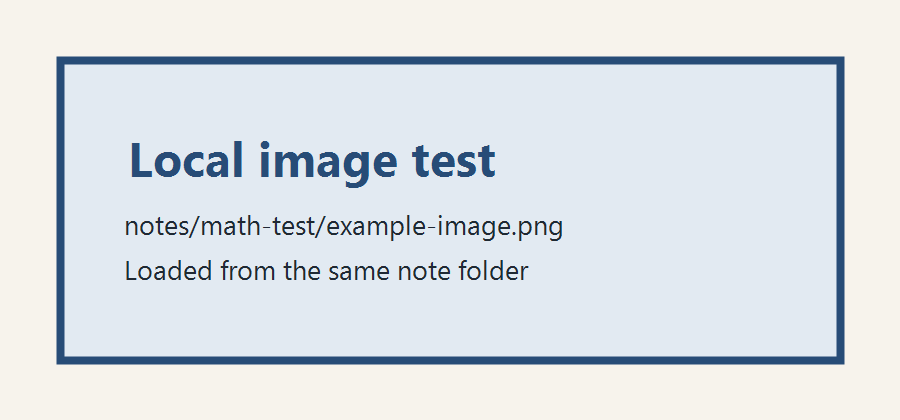

Markdown · MathJax · Images

# Math and Image Test

This note tests Markdown, local images, and LaTeX rendering.

## Inline Math

Einstein's mass-energy relation is $E = mc^2$.

The inductor voltage is \(v_L = L\frac{di_L}{dt}\).

## Block Math

State-space form:

$$
\dot{x} = Ax + Bu
$$

Boost converter averaged model:

$$
\frac{di_L}{dt} = \frac{V_{in} - (1-D)v_C}{L}
$$

$$
\frac{dv_C}{dt} = \frac{(1-D)i_L - \frac{v_C}{R}}{C}
$$

## Local Image Test

The following image should be loaded from the same note folder:

